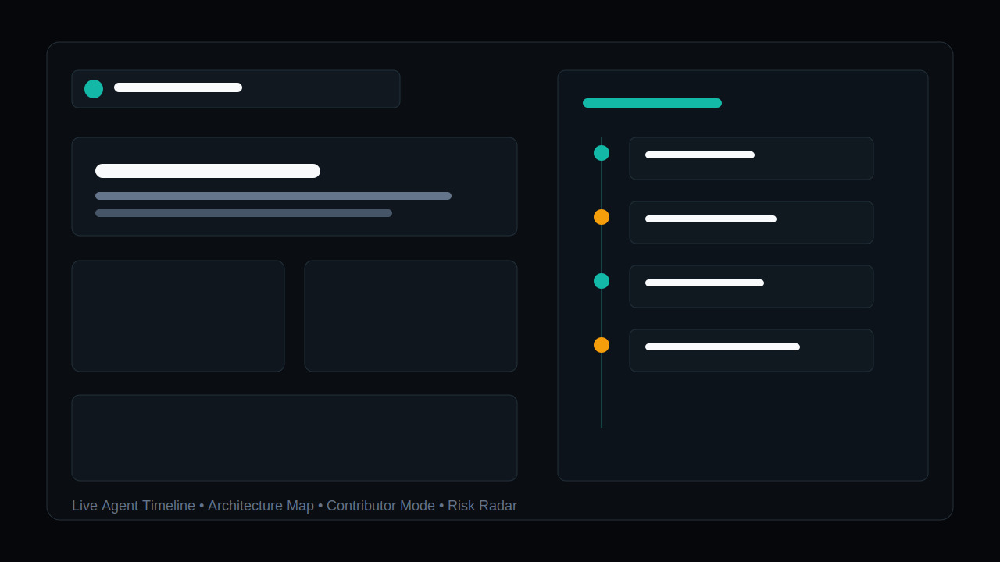
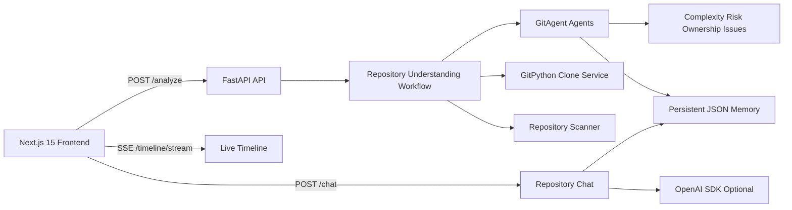

<p align="center">
  
</p>

<p align="center">
  <strong>Understand any repository in minutes.</strong>
</p>

<p align="center">
  
  
  
  
</p>

CodeSherpa AI is an AI onboarding and contribution copilot for open-source repositories. Paste a GitHub URL and watch autonomous agents clone, scan, map, score, explain, and remember a codebase through a live timeline.

It is designed to feel like an AI operating system for repositories: observable workflows, persistent memory, contributor guidance, architecture visualization, and contextual chat grounded in actual repository evidence.

## Problem

Open-source onboarding is slow because repository knowledge is scattered across source folders, stale docs, tests, manifests, issues, and maintainer intuition. New contributors often ask the same questions:

- Where do I start?
- Which files matter?
- How risky is this change?
- What is a realistic first contribution?
- Who likely owns this area?

CodeSherpa compresses that discovery loop into a guided, evidence-backed workflow.

## Product Preview

<p align="center">
  
</p>

## Demo

Demo flow for a 3-5 minute walkthrough:

1. Open the landing page and show the GitAgent-native structure.
2. Paste `https://github.com/vercel/next.js` into the dashboard.
3. Watch the AI Agent Timeline stream clone, scan, framework detection, architecture mapping, intelligence scoring, onboarding, and memory events.
4. Show complexity score, dependency/risk radar, ownership mapping, and generated good-first issues.
5. Open Architecture to show the interactive system map.
6. Open Contributor Mode to show contribution paths and beginner-friendly files.
7. Ask Repository Chat: "Suggest good first issues" or "What is the complexity and risk profile?"

## Why This Exists

Most repository AI demos are chat wrappers. CodeSherpa is built around the GitAgent philosophy: the repository itself is the agent.

This repo includes real, version-controlled agent identity, rules, tools, skills, memory, workflows, and sub-agents:

```txt
.
├── agent.yaml
├── SOUL.md
├── RULES.md
├── skills/
├── memory/
├── workflows/
├── tools/
├── agents/
├── backend/
└── frontend/
```

## Features

- Autonomous repository analysis with GitPython cloning.
- Manifest and framework detection for JavaScript, TypeScript, Python, Go, Rust, and common web stacks.
- Live SSE workflow timeline for cinematic agent execution logs.
- Architecture map with folder relationships, boundaries, and dependency flow.
- Contributor Mode with learning sequence, beginner files, first tasks, and difficulty estimates.
- AI-generated Good First Issues grounded in detected files and folders.
- Repo complexity scoring with evidence-backed drivers.
- Dependency and risk insights for docs, tests, lockfiles, CI, and framework surface area.
- Smart ownership mapping that groups folders into responsibility surfaces without inventing maintainers.
- Repository chat grounded in persistent analysis memory.
- Optional OpenAI SDK enhancement when `OPENAI_API_KEY` is available.
- Read-only scanner that does not execute or modify analyzed repository code.

## GitAgent Design

CodeSherpa follows the official GitAgent standard: `agent.yaml` configures identity, model preferences, tools, skills, memory, workflows, and agent delegation; `SOUL.md` defines voice and operating posture; `RULES.md` defines strict guardrails.

The five modular agents are:

- Repository Analysis Agent
- Architecture Mapping Agent
- Onboarding Agent
- Issue Debugging Agent
- Documentation Agent
- Repository Intelligence Agent

Each agent has a corresponding skill under `skills/` and sub-agent manifest under `agents/`.

## Architecture



Backend structure:

```txt
backend/
├── api/
├── agents/
├── workflows/
├── services/
├── github/
├── memory/
└── utils/
```

Frontend structure:

```txt
frontend/
├── app/
├── components/
│   ├── product/
│   └── ui/
└── lib/
```

## API

- `POST /analyze`
- `POST /chat`
- `GET /timeline/{repo_id}`
- `GET /timeline/stream?repo_url=...`
- `GET /architecture/{repo_id}`
- `GET /onboarding/{repo_id}`
- `GET /intelligence/{repo_id}`
- `GET /repo-summary/{repo_id}`

## Setup

### One-command local startup

Use the launcher for local development. It detects the Python dependency workflow, installs missing backend and frontend dependencies, validates `.env`, chooses available ports, writes the selected backend URL into `frontend/.env.local`, and starts both services.

Windows:

```bat
start-dev.bat
```

Linux/macOS:

```bash
./start-dev.sh
```

Diagnostics only, without starting servers:

```bash
npm run dev:check
```

Smoke test both services and shut them down automatically:

```bash
npm run dev:smoke
```

The launcher prefers backend port `8000` and frontend port `3000`. If either port is unavailable, it prints the owning process when possible and falls back automatically, for example to backend `8001` or `8010` and frontend `3001` or `3010`.

### Manual fallback commands

Run these from the repository root, not from `backend/`, because `requirements.txt` is stored at the project root:

```bash
python -m venv .venv
.\.venv\Scripts\python.exe -m pip install -r requirements.txt
.\.venv\Scripts\python.exe -m uvicorn backend.main:app --reload --host 127.0.0.1 --port 8001
```

In another terminal:

```bash
set NEXT_PUBLIC_API_URL=http://127.0.0.1:8001
npm --prefix frontend install
npm --prefix frontend run dev -- --hostname 127.0.0.1 --port 3001
```

Open:

```txt
http://127.0.0.1:3001
```

Optional AI enhancement:

```bash
set OPENAI_API_KEY=sk-...
```

Without an API key, CodeSherpa still performs deterministic repository analysis and memory-backed heuristic chat.

## Docker

Create an environment file:

```bash
cp .env.example .env
```

Run the full stack:

```bash
docker compose up --build
```

Health checks:

```txt
Frontend: http://localhost:3000
Backend:  http://localhost:8000/health
```

The Compose setup persists repository checkouts and memory in Docker volumes.

Validate the GitAgent contract and local backend health:

```bash
npm run validate:startup
```

If the backend is running on a fallback port, pass it to validation:

```bash
set BACKEND_PORT=8001
npm run validate:startup
```

## Product Surface

- Landing Page: startup-grade hero, live workflow preview, GitAgent signals.
- Repository Dashboard: metadata, framework detection, folder explorer, important files, recommendations.
- Architecture Page: interactive architecture map and dependency flow.
- AI Timeline Panel: live autonomous execution logs with animated status.
- Repository Chat: contextual answers with file citations and confidence.
- Contributor Mode: roadmap, beginner files, learning sequence, and first contribution ideas.
- Intelligence Layer: complexity score, risk radar, ownership map, dependency insights, good-first issues.

## Contributor Workflow

1. Analyze a repository.
2. Review complexity and risk signals before choosing a task.
3. Pick a contribution path: docs-first, behavior-first, or feature-area.
4. Use generated good-first issues to define scope.
5. Ask repository chat for file-level guidance.
6. Validate with the repository's detected tests or documented commands.

## Why GitAgent

GitAgent makes the repository itself the agent. That matters for CodeSherpa because repository understanding should be durable, inspectable, and versioned. The agent's identity, rules, skills, memory, workflows, and tools live beside the product code, so hiring reviewers can inspect the AI system design instead of treating it as a black-box prompt.

## Roadmap

- GitHub Issues import and debugging endpoint.
- ChromaDB semantic code chunk memory.
- LangGraph workflow branching for deeper agent delegation.
- Pull request analysis mode.
- Exportable onboarding report.
- Hosted demo with sample repository cache.
- Ownership confidence from CODEOWNERS when present.
- Issue template generation for maintainers.

## Safety

CodeSherpa clones repositories into `backend/.codesherpa/repos`, reads files, and avoids executing repository code. It does not run package managers, install scripts, or mutate target repositories during analysis.

## License

MIT.
