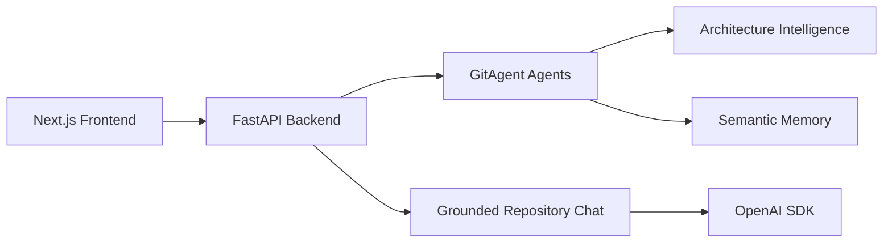

<p align="center">
  
</p>

<p align="center">
  <strong>Understand any repository in minutes.</strong>
</p>

<p align="center">
  
  
  
  
</p>

---

# CodeSherpa AI

A production-ready AI-powered Repository Intelligence & Architecture Analysis platform built using Next.js, React, TypeScript, FastAPI, Python, and advanced graph intelligence systems.

CodeSherpa AI enables developers, contributors, and engineering teams to deeply understand repositories through AI-powered architecture mapping, grounded semantic retrieval, repository onboarding intelligence, dependency analysis, and interactive runtime visualization.

---

# Live Demo

## Live Application

https://codesherpa-ai.vercel.app/

## Backend API

https://codesherpa-ai-3.onrender.com

## Health Endpoint

https://codesherpa-ai-3.onrender.com/health

## GitHub Repository

https://github.com/gagandeepsingh76/Codesherpa-ai

---

# Product Preview

<p align="center">
  
</p>

---

# System Architecture



---

# Application Interface

## Repository Intelligence Dashboard

<p align="center">

</p>

---

## Interactive Architecture Visualization

<p align="center">


</p>

---

## Grounded AI Repository Chat

<p align="center">

</p>

---

## AI Agent Timeline

<p align="center">

</p>

---

# Problem

Open-source onboarding is slow because repository knowledge is scattered across source folders, stale documentation, tests, manifests, and maintainer intuition.

Developers frequently struggle with:

- Where should I start?
- Which files matter most?
- What is the architecture flow?
- How risky is this change?
- Which contribution is beginner friendly?

CodeSherpa compresses this discovery workflow into an AI-native repository intelligence experience.

---

# Key Features

## AI Repository Intelligence

- Semantic Repository Understanding
- Grounded Code Retrieval
- Runtime-aware Analysis
- Symbol Extraction Engine
- Repository Memory System
- Contextual Architecture Reasoning

---

## Interactive Architecture Intelligence

- Layered Architecture Visualization
- Runtime Dependency Mapping
- Infrastructure Clustering
- Progressive Drilldown
- Signal-first Graph Rendering
- Focus & Search Modes

---

## Grounded AI Repository Chat

- File-aware Responses
- Route-aware Intelligence
- Authentication Flow Detection
- State Management Detection
- Runtime Architecture Reasoning
- Semantic Retrieval-backed Answers

---

## Contributor Intelligence

- Good-first Issue Suggestions
- Complexity Scoring
- Ownership Mapping
- Contributor Onboarding Guidance
- Learning Sequence Generation
- Risk-aware Recommendations

---

## Live AI Timeline Streaming

- Autonomous Repository Workflow
- Real-time Event Streaming
- Semantic Memory Updates
- Architecture Build Logs
- Runtime Execution Tracking

---

# Technology Stack

| Technology | Purpose |
|---|---|
| Next.js | Frontend Framework |
| React.js | UI Library |
| TypeScript | Type Safety |
| Tailwind CSS | Styling |
| FastAPI | Backend Framework |
| Python | Backend Runtime |
| D3.js | Interactive Graph Rendering |
| ELK.js | Graph Layout Engine |
| GitPython | Repository Cloning |
| OpenAI SDK | AI Enhancement |
| Render | Backend Deployment |
| Vercel | Frontend Deployment |

---

# Project Architecture

## Frontend (Vercel)

- Next.js App Router
- Interactive Architecture Graph
- Repository Dashboard
- AI Timeline
- Grounded Chat Interface
- Contributor Intelligence UI

---

## Backend (Render)

- FastAPI REST APIs
- Repository Intelligence Engine
- Semantic Retrieval Pipeline
- AST-based Code Analysis
- Dependency Graph Engine
- Runtime Architecture Mapping

---

## Intelligence Engine

### Core Systems

- Symbol Extraction Engine
- Dependency Graph Intelligence
- Repository Memory System
- Runtime Boundary Detection
- Authentication Detection
- Route Registry System

---

# AI Capabilities

| Capability | Description |
|---|---|
| Semantic Retrieval | Grounded repository understanding |
| Architecture Mapping | Runtime-aware graph intelligence |
| Repository Chat | Contextual code explanations |
| Dependency Analysis | Weighted relationship tracing |
| Auth Detection | JWT/RBAC discovery |
| Contributor Guidance | AI onboarding workflow |

---

# API Modules

## Repository Intelligence APIs

- Repository Analysis
- Architecture Mapping
- Dependency Graph Generation
- Semantic Memory Retrieval
- Contributor Insights

---

## AI Chat APIs

- Grounded Repository Chat
- Runtime Explanations
- Symbol Retrieval
- Architecture Reasoning
- File-aware Responses

---

# Environment Variables

## Frontend (.env)

```env
NEXT_PUBLIC_API_URL=https://codesherpa-ai-3.onrender.com
```

## Backend (.env)

```env
OPENAI_API_KEY=YOUR_OPENAI_API_KEY
CODESHERPA_ALLOWED_ORIGINS=https://codesherpaai.vercel.app
PYTHON_ENV=production
```

---

# Local Setup

## 1. Clone Repository

```bash
git clone https://github.com/gagandeepsingh76/Codesherpa-ai.git
cd Codesherpa-ai
```

---

## 2. Install Dependencies

### Frontend

```bash
cd frontend
npm install
```

### Backend

```bash
cd backend
pip install -r requirements.txt
```

---

## 3. Setup Environment Variables

Create `.env` files for frontend and backend.

---

## 4. Run Frontend

```bash
cd frontend
npm run dev
```

---

## 5. Run Backend

```bash
cd backend
uvicorn main:app --reload
```

---

# Docker Setup

## Run Full Stack

```bash
docker compose up --build
```

---

# Product Surface

- Landing Page
- Repository Dashboard
- Architecture Visualization
- AI Timeline Panel
- Repository Chat
- Contributor Intelligence
- Dependency Intelligence
- Runtime Graph System

---

# Deployment Status

| Service | Status |
|---|---|
| Frontend | Live |
| Backend | Live |
| Repository Intelligence | Working |
| Architecture Visualization | Working |
| AI Chat | Working |
| Semantic Retrieval | Working |
| Timeline Streaming | Working |

---

# Future Improvements

- GitHub OAuth Integration
- Multi-repository Analysis
- Pull Request Intelligence
- ChromaDB Semantic Memory
- Exportable Architecture Reports
- Real-time Repository Monitoring
- AI-generated Contributor Tasks

---

# Author

## Gagandeep Singh

- Student Research Associate Intern at IIT Kanpur

---

# License

This project is created for educational, research, portfolio, and advanced AI developer tooling purposes.

Inspired by modern repository intelligence systems, architecture observability platforms, and AI-native developer experience tooling.
